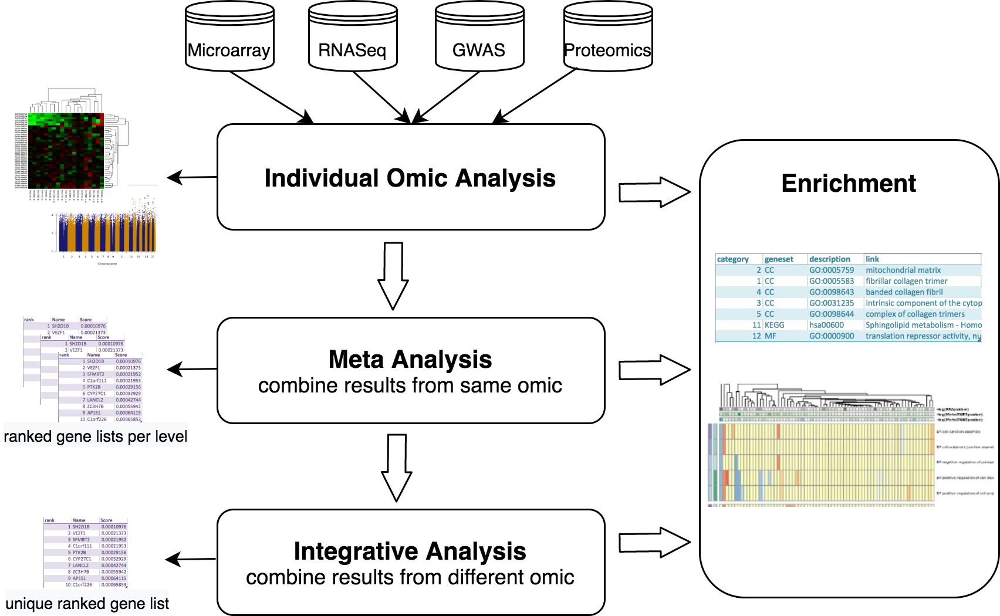
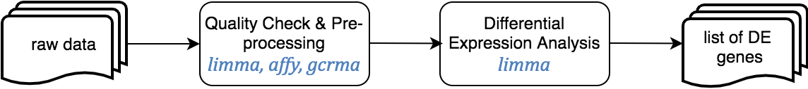
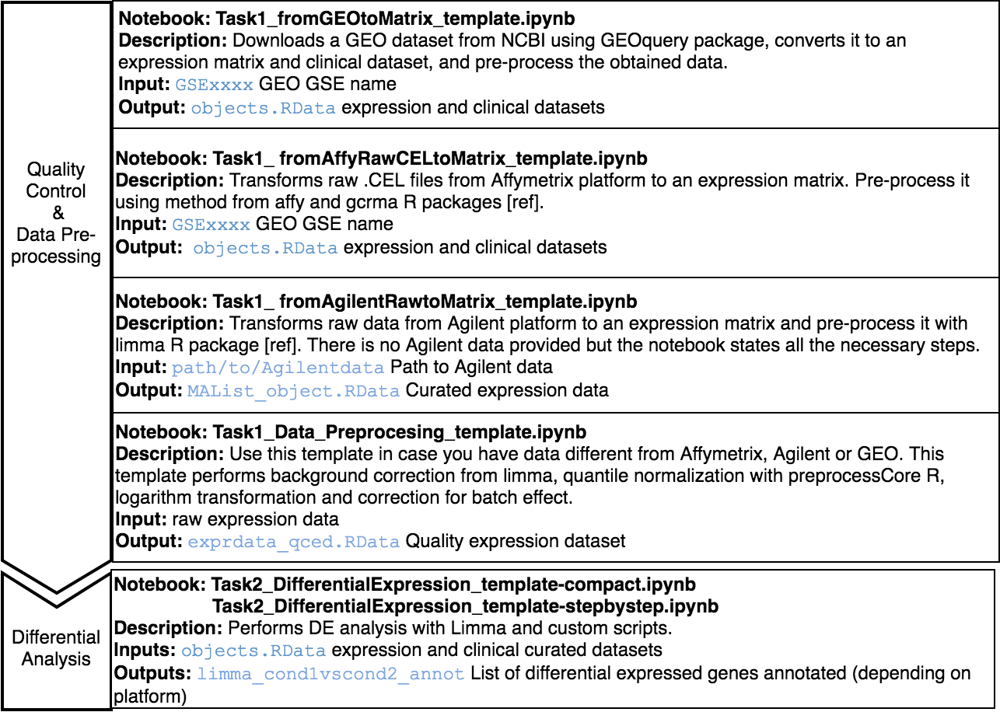
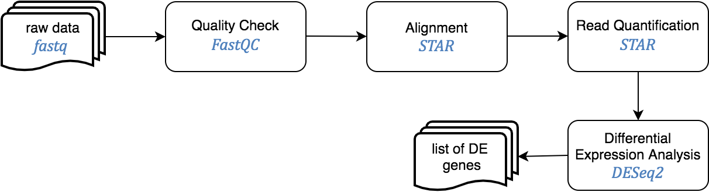
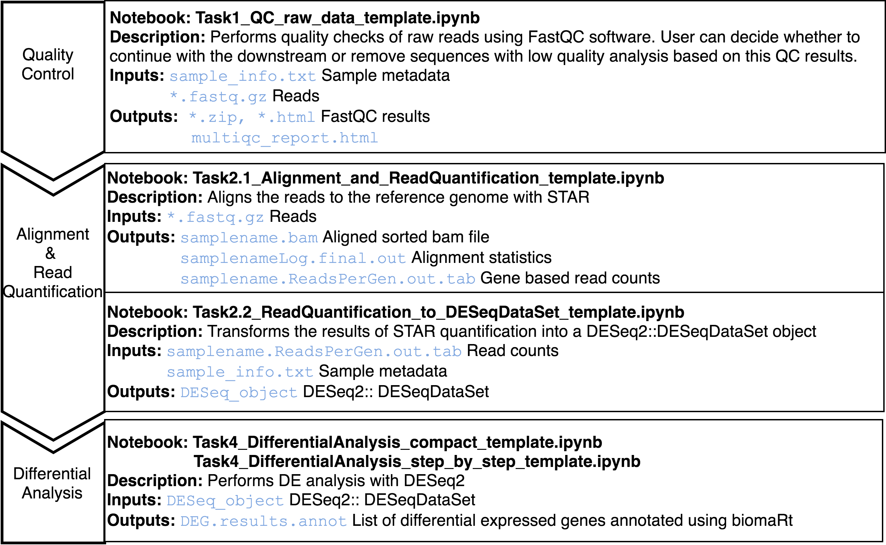
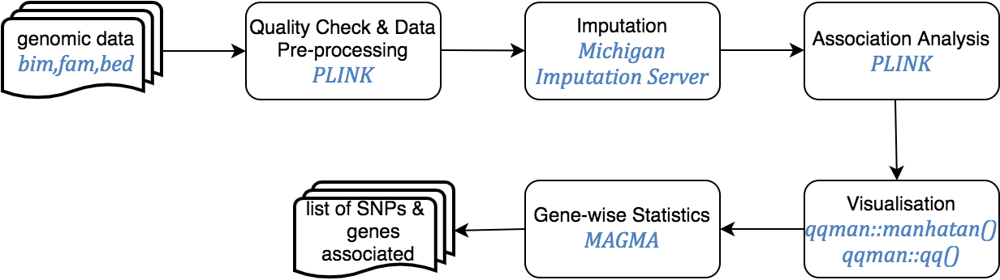
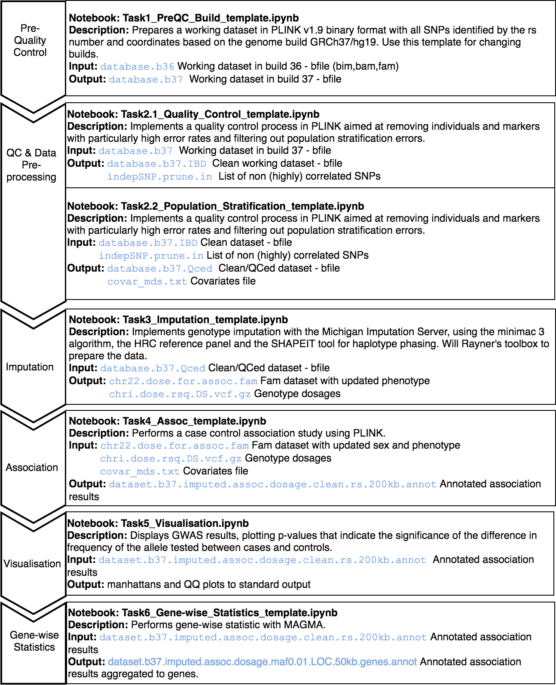
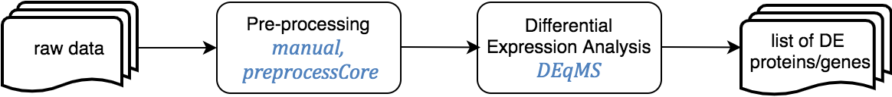
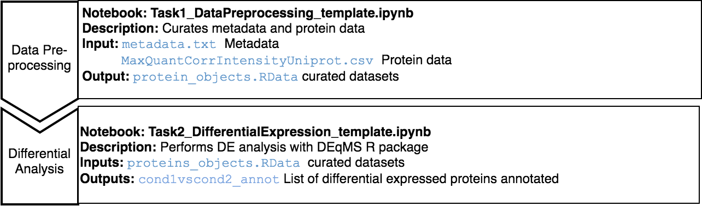

# MOMIC: A Multi-Omics Pipeline for data analysis, integration and interpretation

## Table of contents
1. [Introduction](#introduction)
2. [Installation](#installation)
3. [Jupyter general instructions](#jupyter-general-instrucctions)
4. [Analysis Pipelines](#analysis-pipelines)
    1. [Transcriptomics. Genome Wide Expression Studies (GWES) from Microarray](#transcriptomics-genome-wide-expression-studies-gwes-from-microarray)
    2. [Transcriptomics. Genome Wide Expression Studies (GWES) from RNASeq](#transcriptomics-genome-wide-expression-studies-gwes-from-rnaseq)
    3. [Genome Wide Association Analysis (GWAS)](#genome-wide-association-analysis-gwas)
    4. [Proteomics](#proteomics)
    5. [Meta Analysis](#meta-analysis)
        1. [Meta-Analysis of gene expression data](#meta-analysis-of-gene-expression-data)
        2. [Meta-Analysis of GWAS data](#meta-analysis-of-gwas-data)
    6. [Integrative Analysis](#integrative-analysis)
    7. [Enrichment](#enrichment)

## Introduction

MOMIC offers a complete analysis environment for analysing and integrating multi-omics data in a single, easy-to-use platform.

MOMIC currently compiles protocols for whole genome SNP data (GWAS), mRNA expression (both from arrays and from RNAseq experiments) and protein data. Along with enrichment analysis and methods for combining heterogeneous data at different molecular levels. The proposed protocols are developed as Jupyter notebooks guiding the user through the tasks of pre-processing and transforming the data and performing the actual analysis, allowing the user to modify any piece of code needed along the process to adequate it to each project.
These protocols are based on accepted articles and best practices available in the literature.

The data analysis workflows starts with the pre-processing and quality control of the individual datasets. Each of the datasets are then independently analyzed following appropriate protocols. To consolidate these independent results for the same omic, a meta-analysis can be performed, generating single lists of SNPs or genes. After this, one can take a step forward and combine diverse omic results, along with functional genomics analysis, and try to elucidate the potential causative changes that lead to disease. With this integrative approach the user can get a single ranked list of candidate genes summarising the heterogeneous data at different molecular levels. Finally, visualization and pathway analysis tools are available to further explore analysis results. This whole procedure has been summarized in the next figure.

MOMIC is presented as a collection of Jupyter notebooks using JupyterHub with JupyterLab deployed, written mainly in R language and containerized in Docker. 

## Access

The web tool can be accessed at [momic.us.es](momic.us.es). The default user is `momic`and password is `m0m1c`. Request new credentials to `lmadrid@caebi.es`. Note this alternative is intended for light analysis or quick testing. 

The recomendation is to install MOMIC locally. For this purpose, it is distributed as a docker-compose project that contains the instructions needed to automatically create a fully working machine with JupyterHub, convenient extensions enabled, like git and table of content, docker volumes for data persistence, the pipeline source code and all the necessary libraries and third-party software. Having MOMIC locally built allows you to install new tools and libraries and fully customised this bioinformatics suit.

The data used for illustration purposes can be found at https://momic.us.es/momic_data/, except for IGAP and BLSA. The user is `momic`and password is `m0m1c`.

## Installation

 <a href="#table-of-contents">top</a> 

The only requisite to install MOMIC locally is to have Docker and docker-compose already installed. Docker is a platform used to develop, deploy, and run applications with containers. Follow the instructions on each project website ([docker](https://docs.docker.com/install) and [docker-compose](https://docs.docker.com/compose/install)).

The minimun RAM memory recommended is 56GB. It may need to be increased with large datasets, specially for some process during a RNASeq Analysis or an imputation of GWAS data. Disk space can vary depending on the size of your data; 260GB is the actual size of the data volume of momic.us.es. MOMIC has been tested on Ubuntu, CentOS, Windows and macOS servers.

Follow the next steps to quickly get MOMIC up and running locally:

- clone MOMIC_server in your local directory via `git clone https://github.com/laumadmar/MOMIC_server.git` and inspect the content
- cd into that directory
- run `docker pull laumadmarq/momic:latest` to download the docker image. You can ensure that the image is installed by using `docker images`
- run `docker-compose up` and once the server is up, press `CTRL+c` to stop the console output
- run `docker-compose start` to keep the service running in the background
- access the tool at http://localhost:8000/jupyter and log in with user momic, pass m0m1c 

An alternative is to create your container from the original instructions, which can be fully customised. After clonning MOMIC_server from the repository, rename the file `Dockerfile.steps` to `Dockerfile`. 
- run `docker pull ubuntu:18.04` to download the ubuntu docker image
- run `docker-compose up` and once the server is up, press `CTRL+c` to stop the console output
- run `docker-compose start` to keep the service running in the background
- ssh into the container executing the access script (`./access`) and type `nohup Rscript /tmp/install_specific_libraries.R &` to install the required R packages
- access the tool at http://localhost:8000/jupyter and log in
- clone MOMIC Notebooks repo from jupyter or from the terminal after ssh into the container. For the former, go to the git tab located in the left menu, click on the button ‘Clone a Repository’ and provide the repo url. For the latter, ssh into the container, cd into momic home directory and type  `git clone https://github.com/laumadmar/MOMIC_notebooks.git`

It is strongly recommended to inspect the [step by step guide](#installation_steps.html) to get a detailed explanation of this process, how MOMIC_server can be fully customised and access to some useful scripts and commands.

If you run into any issues it is likely that the port 8000 is already in used in your host machine or you need to configure any parameters specified in the `docker-compose.yml` file. Follow the step by step instrucctions in this case.

## Jupyter general instrucctions

 <a href="#table-of-contents">top</a> 

The Jupyter Notebook is an open-source web application that allows you to create and share documents that contain live code, equations, visualizations and narrative text. JupyterHub brings the power of notebooks to groups of users.

You will find all the notebooks needed to complete the different analysis in your home directory (first screen right after login).

Notebooks are provided as read-only, we call them templates. To create your own notebook from a template, select the desired template and click on the Duplicate button. Select the new notebook and right-click to see the Rename button. An alternative if using the classic theme is to click on the name of the new notebook to open it and change the name once opened.

It is possible to create a fresh empty notebook in whichever directory you want from the plus button located at the top left menu (or 'New' button if using the classic notebook). If you want to replicate an analysis, follow the same steps indicated in the corresponding template. Note that a cell can have different types, we are working here with markdown and code cells. Thi can be changed in the top menu. In the same way, you can create a new text or markdown file and open a terminal window. Note you can use the two subsequent icons to create a new folder or upload a new file. This is the manner in which you can upload your own data to MOMIC webserver.

To execute a cell, press `CTRL+ENTER` or click on the Run button located in the top menu. Alternatively, `CTRL+ALT` to create a new empty code cell bellow it. 

Inspect the menus to go through all Jupyter features or visit the Jupyter Project Documentation website to know more (https://jupyter-notebook.readthedocs.io/en/stable/ and https://jupyterlab.readthedocs.io/en/stable/)

## Analysis pipelines

 <a href="#table-of-contents">top</a> 

Notebooks are provided as read-only and we refer to these as templates. As explained in the previous [section](#jupyter-general-instrucctions), create your own notebook, a duplicate or an empty one, and modify paths and/or code according to your needs. Execute code in cells with CTRL+ENTER or clicking on the Run button located at the top menu. Alternatively, CTRL+ALT to create a new empty code cell below it.

Read carefully the comments on the Jupyter templates as they explain in detail the code and protocol used to perform the different steps of each analysis.

In order to modify a core pipeline function, duplicate the original script, rename it, do the desired changes and save it. Note that the cell that imports these functions in your template, the one that contains this code `source("scripts/whatever.R")`, has to be run after the changes.

### Transcriptomics. Genome Wide Expression Studies (GWES) from Microarray

 <a href="#table-of-contents">top</a> 

RNA microarrays, are tools that allow the identification and quantification of the mRNA transcripts present in the cells. RNA microarrays can simultaneously measure the expression level of thousands of genes within a particular mRNA sample. Such high-throughput expression profiling can be used to compare the level of gene transcription in clinical or biological conditions in order to find differences in expression levels between predefined groups of samples. This is called differential expression (DE) analysis.

This pipeline starts from raw expression data or an expression matrix, and ends with a set of differentially expressed genes annotated using Entrez and Human Genome Nomenclature Committee (HGNC) offical gene symbols.

The Jupyter templates to follow for completing a Microarray analysis can be found under the home directory, MOMIC_notebooks/GWES/Microarray. Create your own notebook as explained in [section 3](#jupyter-general-instrucctions) and follow the protocol detailed.

Before running a DE analysis, it is critical to perform a thoroughly data cleaning and pre-processing. It is also essential that expression and clinical datasets contain the same samples and in the same order. Pre-processing steps involve transforming raw data into a matrix of normalized intensities, using the RMA, limma or preprocessCore R packages depending on the data platform. Bath effect removal is also available through the combat function of the sva package.

For the DE analysis, we use R package limma [ref] as part of a customised expression pipeline. Note the use of `source("/home/guess/scripts/diffExpressionPipeline.R")` to import the custom script. This performs a DE analysis over the dataset supplied and can be adjusted to your needs via the input parameters. Specify the contrast or conditions you want to compare, i.e., case versus control or treatment1 versus treatment2. It is possible to perform the DE on a subset of the data, i.e., only in male population. You can also provide the variables you want to include in the model to adjust for these covariates, excluding their effect. The details for the parameters of this function can be found in the template itself.

Two notebook templates are provided, called compact and step_by_step. Both implement the same functionality but the last one does it in a more detailed and comprehensive way but more tedious to programmatically execute the analysis. In addition to the dataset analysed in the template, another one is done in the same way to be able to perform a posterior meta-analysis (explained in section **x**).

Regarding gene annotation, if there is more than one gene matching the same probe, deduplication can be performed during the pre-processing step (as illustrated in the Affymetrix rma protocol) or after DE, keeping only the probe with the lowest p value, as gene representative towards integrative analysis.

To illustrate this analysis, datasets GSE48350 and GSE15222, from the Gene Expression Omnibus (GEO) database have been used.

### Transcriptomics. Genome Wide Expression Studies (GWES) from RNASeq

 <a href="#table-of-contents">top</a> 

RNA-Seq is a particular technology-based sequencing technique which uses next generation sequencing (NGS) to reveal the presence and quantity of RNA in a biological sample at a given moment. Gene expression is quantified by counting the number of reads that mapped to each locus in the transcriptome assembly step.

This pipeline starts from raw sequence reads, and ends with a set of differentially expressed genes.

The Jupyter templates to follow for completing a RNASeq analysis can be found under the home directory, MOMIC_notebooks/GWES/RNASeq. Create your own notebook as explained in [section 3](#jupyter-general-instrucctions) and follow the protocol detailed.

An important step is to look at the quality of the raw reads before proceeding with the analysis. This can be done using fastqc java program. The sensible step after this is to remove sequences with low quality to get better alignment in the later steps. To determine where on the human genome our reads originated from, these are aligned to the reference genome using STAR. Read quantification is performed at the same time with STAR.

Last step is DE analysis, done with DESeq2, to find differences in expression levels between predefined groups of samples. Two notebook templates are provided, called compact and step_by_step. Both implement the same functionality but the last one does it in a more detailed and comprehensive way but more tedious to programmatically execute the analysis.

To illustrate this analysis synthetic data have been generated.

### Genome Wide Association Analysis (GWAS)

 <a href="#table-of-contents">top</a> 

Genome Wide Association Studies are hypothesis free methods to identify associations between genetic regions (loci) and traits (including diseases). It has long been known that genetic variation between individuals can cause differences in phenotypes. These causal variants, and those which are tightly linked to their region of the chromosome, are therefore present at higher frequency in cases (individuals with the trait) than controls (individuals without the trait).

The GWAS protocol is available for genome builds GRCh37/hg19 and GRCh38/hg38, including the UCSC liftOver tools for updating genetic positions.

This pipeline starts from genomic data in PLINK format, and ends with SNPs annotated for rs identifiers (dbSNP v150 for the GRCh37 pipeline and dbSNP v151 for the GRCh38 pipeline) and HGNC annotated genes.

A series of templates are presented to complete a whole GWAS study following the guidelines on Anderson et al. protocol. These are under the GWAS folder in the home directory and are provided in read-only mode. Create your own notebook as explained in [section 3](#jupyter-general-instrucctions) and follow the protocol detailed.

An initial standard quality control needs to be performed; it consists on:

1. Exclusion of individuals: a) with more than 3% missing genotypes, b) with excess autosomal heterozygosity (>0.35 or more than ± 3 standard deviations from the mean), c) showing a discrepancy between genotypic and reported sex or d) showing non-European ancestry. Duplicated and related individuals are also removed by means of IBS estimates (pi-hat >0.1875) within and across studies.

2. Exclusion of SNPs: a) with missing genotype rate > 5%, b) with significant missingness test between cases and controls (p<10−6), c) not in Hardy-Weinberg equilibrium (p<10-6 in controls) and d) SNPs with minor allele frequency (MAF) < 1%.

After the QC, genotype imputation of build GRCh37/hg19 can be performed at the Michigan Imputation Server, using the minimac 3 algorithm, the HRC reference panel and the SHAPEIT tool for haplotype phasing. For GRCh38/hg38 data, imputation is performed at the TopMed server, which uses the minimac4 algorithm and Eagle v2.4 for phasing, with the TopMed population as reference. After imputation, SNPs with an R2 quality estimate lower than 0.3 are excluded from further analyses according to the software recommendations.

Following the QC and optional imputation, a case control association study can be performed with PLINK in order to identify genetic variants or SNPs that can be associated with a trait. Gene-wise statistics can be then computed using MAGMA software, which takes into account physical distance and linkage disequilibrium (LD) between markers to aggregate this data to the level of whole genes.

Finally, results are inspected using Manhattan and QQ plots.

The two main protocols followed in this pipeline are: Anderson, et. al. Data quality control in genetic case‐control association studies [ref] and Marees AT, et. al. A tutorial on conducting genome-wide association studies. It is very recommended that you read first these two papers if you had little knowledge about this kind of analysis.

The data used to illustrate this analysis is taken from the 1000 Genomes Project. We have slightly modified this dataset updating the identifiers to rsID, removing SNPs with minor allele frequency < 0.01 and prunning the number of SNPs in order to reduce the computation time.

### Proteomics

 <a href="#table-of-contents">top</a> 

Expression Proteomics pipeline involves includes the analysis of differentially expressed proteins between conditions, such as diseased vs. healthy tissue.

This pipeline starts from the intensity matrix, as the quantitation and identification of proteins are not cover here, and ends with a set of differentially expressed proteins.

The Jupyter templates to follow for completing a Differential Analysis can be found under the home directory, MOMIC_notebooks/Proteomics. Create your own notebook as explained in [section 3](#jupyter-general-instrucctions) and follow the protocol detailed.

Before running a differential protein expression analysis, it is very important to do data cleaning and pre-processing. It is also essential that the intensity matrix and metadata contain the same samples and in the same order. This pre-processing consists on removing decoy matches and matches to contaminant, extracting the LFQ intensities columns, filtering on missing values, log transformation, normalisation, unique peptide counting and visualisation.

For the differential analysis, we use DEqMS R package. DEqMS builds on top of limma and improves it with proteomics data specific properties, accounting for variance dependence on the number of quantified peptides or PSMs for statistical testing of differential protein expression.

Proteomics data from postmortem brain tissue have been collected from The National Institute on Aging’s Baltimore Longitudinal Study of Aging (BLSA) (Synapse 10.7303/syn3606086).

### Meta-Analysis

 <a href="#table-of-contents">top</a> 

Meta-analysis is the statistical procedure for synthesising data across studies. It can be performed when there are multiple studies addressing the same question and the same molecular level. This analysis is to be conducted after the individual analysis have been completed. Two different protocols are provided here, one for combining multiple GWAS results and another for transcriptomics and proteomics results.

### Meta-Analysis of gene expression data

This one-step pipeline starts from the results of the DE analysis of various studies, and ends with a unified list of differentially express genes or proteins across studies – with its correspondent average effect sizes and p values.

The MetaDE R library is used to perform this analysis. The Random Effects Model (REM) algorithm takes as input the p values, observed effect size (logFC values) and observed variance to compute summary logFCs and associated statistics. . The Variance is calculated as Standard Error (SE)^2, and SE is calculated as the difference of confidence intervals divided by 3.92. Additionally, a Fisher exact test on p-values can also be performed. The original MetaDE algorithm have been slightly modified to account for genes that are not present in all input studies.

The templates for this meta-analysis can be found in the MetaAnalysis/GWES folder under MOMIC_notebooks within the home directory. This portocol has been illustrated using microarray data, but RNASeq and proteomics can be done in the same way. Note the cell that imports the core pipeline functions `(source ("/home/guess/scripts/metaDE.R")`, it is very important that you run this cell first.

The example notebook provided combines the two limma tables obtained from the DE analysis performed following [section 4.A GWES](#transcriptomics.-genome-wide-expression-studies-(gwes)-from-microarray). The core pipeline function used in this template, `prepare_matrix_function`, is ready to take as input limma datasets containing logFC, confidence intervals and p value. Any output from a different DE algorithm can be used as long as you prepare the datasets accordingly to run the MetaDE algorithm.

### Meta-analysis of GWAS data

This one-step pipeline starts from SNP level GWAS results and ends with a single list of  SNPs and associated summary statistics.

The analysis is peformed using METAL, which allows two analyses scehemes: SAMPLESIZE (default approach, uses p-value and direction of effect, weighted according to sample size) and STDERR (the classical approach, uses effect size estimates and standard errors) A Cochran’s Q test and I2 statistics are generated to evaluate the potential effect of study heterogeneity on the results.

The template for this meta-analysis can be found in MetaAnalysis/GWAS under MOMIC_notebooks within the home directory. The template is provided as read-only. As explained in [section 3](#jupyter-general-instrucctions), create your own notebook (a duplicate or an empty one) and modify paths and/or code according to your needs.

For illustration purposes, a meta-analysis have been conducted with datat from (IGAP) and the results of the GWAS analysis performed following [section 4.C](#genome-wide-association-analysis-(gwas)).

## Integrative analysis

 <a href="#table-of-contents">top</a> 

Integrative Analysis aims to consolidate heterogeneous data at different omics levels to understand their interrelation and combined influence on the disease processes.

This one-step pipeline starts from the results of the meta-analysis for different studies, and ends with a unified ranked list of differentially expressed genes.

The integration is performed using Robust Rank Aggregation (RRA) method (Kolde R et al., 2012). It detects genes that are ranked consistently better than expected under null hypothesis of uncorrelated inputs and assigns a significance score for each gene.

For each item, the algorithm looks at how the item is positioned in the ranked lists and compares this to the baseline case where all the preference lists are randomly shuffled. As a result, it assigns a P-value for all items, showing how much better it is positioned in the ranked lists than expected by chance. This P-value is used both for re-ranking the items and deciding their significance.

Since the number of informative ranks is not known, RRA defines the final score for the rank vector r as the minimum of P-values and orders all rank vectors according to their ρ scores. The obtained gene list is ranked according to this global score, using the Rank library from the R Basic package. The same rank is assigned to those genes with NA score.

The template for this analysis can be found in the folder IntegrativeAnalysis under the home directory. It combines the results from the meta-analysis of microarray expression data obtained following [section 4.A GWES](#transcriptomics.-genome-wide-expression-studies-(gwes)-from-microarray), with the GWAS analysis results obtained following [section 4.C GWAS](#genome-wide-association-analysis-(gwas)). 

## Enrichment analysis

 <a href="#table-of-contents">top</a> 

Enrichment analysis, or pathway analysis, can identify terms which are statistically over or under-represented within the list of interest, by systematically mapping genes and proteins to their associated biological annotations, such as gene ontology GO terms or pathway membership, and then comparing the distribution of the terms within a gene set of interest with the background distribution of these terms (e.g., all genes represented on a microarray chip).

This one-step pipeline starts from the list of genes to explore, and ends with a list of categories and its associated statistics along with visualization plots.

The enrichment is performed using WebGestalt in R and the visualization  with GOplot package and pheatmap from R CRAN.

Various templates can be found in the folder Enrichment under the home directory. In this case the enrichment is done from the results of the meta-analysis case-control completed following [section 4.E.a Meta GWES]. Read carefully the templates as these contain detailed explanation of the code implemented.

- enrichment_GOplots_template.ipynb: this template performs the enrichment for all predefined categories and prints the GO plots.

- enrichment_GOplots_loop_template.ipynb: this template does the same as the previous one but includes a loop through more than one dataframe to perform the enrichment on.

- pheatmap_template.ipynb: this template uses the R library pheatmap to represent combined results from meta expression, meta GWAS, integrative analysis and enrichment of meta expression, completed following the different analysis available in this pipeline.

Templates are provided as read-only. As explained in [section 3](#jupyter-general-instrucctions), create your own notebook (a duplicate or an empty one) and modify paths and/or code according to your needs. Execute code in cells with `CTRL+ENTER` or doing click on the Run button located at the top menu. Alternatively, `CTRL+ALT` to create a new empty code cell bellow it.

